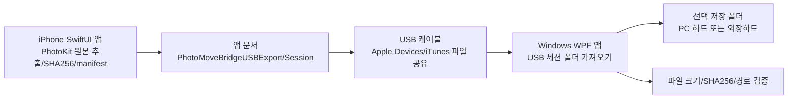

# PhotoMove Bridge 구현 산출물

## 1. 전체 시스템 아키텍처

출시판은 USB 전용 흐름입니다. iPhone 앱은 PhotoKit으로 원본 사진/동영상을 읽어 앱 문서 폴더에 USB 내보내기 세션을 만들고, Windows 앱은 사용자가 선택한 그 세션 폴더를 PC 하드 또는 외장하드 대상 폴더로 가져와 검증합니다. 외부 서버, 클라우드 서버, 로컬 네트워크 업로드 서버를 사용하지 않습니다.



## 2. iPhone USB 내보내기 구조

```text
PhotoMoveBridgeUSBExport/
  PhotoMoveBridge-YYYYMMDD-HHMMSS/
    manifest.json
    YYYY-MM/
      YYYY-MM-DD/
        originalFilename
```

`manifest.json`에는 파일별 asset id, resource id, 원본 파일명, 상대 경로, 촬영일, 미디어 타입, 파일 크기, SHA256이 기록됩니다. 이 폴더와 하위 파일은 백업 제외 속성으로 표시됩니다.

## 3. Windows 저장 구조

저장 루트는 Windows 앱에서 컴퓨터 하드 또는 외장하드 폴더로 선택합니다.

```text
선택저장루트\YYYY-MM\YYYY-MM-DD\originalFilename
선택저장루트\Unknown-Date\originalFilename
```

중복 파일은 `IMG_1234_001.HEIC`처럼 증가 suffix를 붙입니다. Windows 금지 문자는 `_`로 치환합니다.

## 4. 화면 구성

iPhone 앱:

- 권한: PhotoKit 읽기/쓰기 권한, 제한된 접근 안내 및 수정
- USB: USB 이동 방식과 최근 내보내기 경로 안내
- 사진: 월/일/개별 리소스 선택
- 이동: 선택 수, USB 내보내기 생성, 진행률, 결과 이동
- 로그: 세션/파일별 성공, 실패, 삭제 결과

Windows 앱:

- 시작: USB 이동 순서와 출시판 연결 방식 안내
- 저장 폴더: 드라이브 목록, 저장 루트 선택, 쓰기 테스트, 대상 확정
- USB 가져오기: iPhone USB 내보내기 세션 폴더 선택, 가져오기 시작
- 진행: 현재 파일, 전체/성공/실패/대기 카운트, 파일별 진행 상태
- 결과: 저장 폴더 열기, 로그 열기, 파일별 결과 목록

## 5. 검증 규칙

- Windows 앱은 저장 대상이 준비되지 않았거나 쓰기 테스트가 실패하면 가져오기를 시작하지 않습니다.
- 각 파일은 `.partial` 파일로 복사됩니다.
- 복사된 파일 크기가 manifest의 `fileSize`와 다르면 실패 처리합니다.
- 복사된 파일의 SHA256이 manifest의 `sha256`과 다르면 실패 처리합니다.
- 최종 저장 경로가 선택한 저장 루트 밖이면 실패 처리합니다.
- 검증 성공 후에만 `.partial` 파일을 최종 파일명으로 이동합니다.

## 6. 출시 체크리스트

- [x] iOS 비공개 `PHAssetResource` KVC 파일 크기 접근 제거
- [x] iOS 카메라/로컬 네트워크/Bonjour/ATS 예외 권한 제거
- [x] iOS USB 내보내기 폴더 백업 제외 처리
- [x] iOS 삭제 경로 복구: `confirmWindowsVerification()`로 검증 확인 → `.deleteReady` 승격(도달 가능)
- [x] iOS 사진 권한 설명에 삭제 목적 명시, 미사용 `NSPhotoLibraryAddUsageDescription` 제거
- [x] iOS `ITSAppUsesNonExemptEncryption=false` 추가(수출 규정 자동 처리)
- [x] iOS `AccentColor` 에셋 추가(빌드 경고 제거)
- [x] iOS 로그/캐시 JSON을 Application Support로 이동(파일 공유 노출 차단)
- [x] App Store Connect 심사 노트/개인정보 라벨 가이드 작성(`docs/APP_REVIEW_NOTES.md`, `docs/APP_STORE_CONNECT.md`)
- [x] Windows Wi-Fi 서버/QR UI 제거
- [x] Windows `win-x64` self-contained single-file publish 설정
- [x] Windows 앱 아이콘 설정
- [x] 선택적 코드서명 publish 스크립트 추가
- [ ] Windows PC에서 `.\Publish-Windows.ps1` 실행 및 실행 파일 서명 확인
- [ ] App Store Connect에 개인정보 라벨 입력·심사 노트 붙여넣기(가이드대로 제출)
- [ ] 실제 iPhone + Windows PC + 외장하드로 대용량 세션 가져오기 테스트

## 7. 테스트 시나리오

- iPhone에서 사진 1장 USB 내보내기 후 Windows 내부 드라이브로 가져오기
- iPhone에서 동영상 1개 USB 내보내기 후 외장하드로 가져오기
- 월 전체 선택 후 세션 생성과 manifest 파일 수 확인
- 같은 파일명이 있는 경우 `_001` 중복 파일명 처리 확인
- 저장 대상 용량 부족 시 실패 처리 확인
- 쓰기 권한 없음 시 대상 확정 실패 확인
- 가져오기 중 외장하드 분리 시 실패 처리 확인
- 해시 불일치 manifest로 실패 처리 확인
- Windows 결과 로그와 저장 폴더 파일 수 비교
